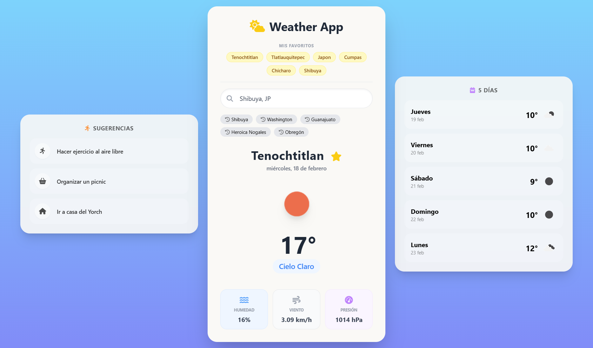

# Weather App - OpenWeather API

Aplicación de clima moderna, minimalista y responsiva construida con **Vanilla JavaScript** y **Tailwind CSS**.
Permite obtener información meteorológica en tiempo real de cualquier ciudad del mundo utilizando la API de OpenWeather.

---

## Características

- **Búsqueda inteligente**
  Utiliza el API de Geocoding de OpenWeather para obtener coordenadas precisas.

- **Datos en tiempo real**
  - Temperatura
  - Descripción del clima
  - Humedad
  - Velocidad del viento
  - Presión atmosférica

- **Interfaz dinámica**
  - Iconos oficiales de OpenWeather
  - Fecha formateada en español

- **Diseño responsive**
  Totalmente adaptada a dispositivos móviles con Tailwind CSS.

- **Experiencia de usuario fluida**
  - Estados de carga (spinners)
  - Manejo de errores (ciudad no encontrada, errores de red)

---

## Tecnologías utilizadas

- HTML5 & CSS3
- Tailwind CSS
- JavaScript
- Font Awesome
- OpenWeatherMap API

---

## Instalación y Configuración

### Clona el repositorio

```bash
git clone https://github.com/MaikyAhoyo/WeatherAPI.git
cd weather-app
```

### Configura tu API Key

- Regístrate en OpenWeatherMap y obtén una clave gratuita.
- Crea un archivo config.js.
- Inserta:

```js
const config = {
  apiKey: "TU_API_KEY",
};
```

---

## URL de la página hosteada

https://weather-api-ten-kohl.vercel.app

### Preview


